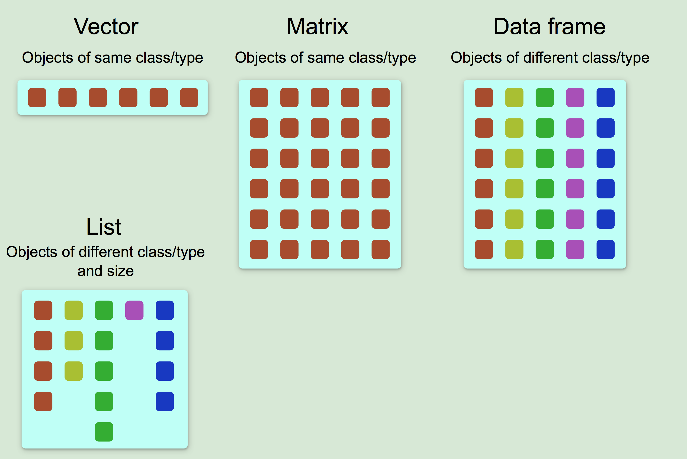

# Lesson 1

```R
# Set working directory or through session
setwd("") 

# Show all the data with the header
my.data <- read.table("ExampleFile.csv", sep = ",", fill = TRUE)

# Show data without the header
my.data <- read.table("ExampleFile.csv", sep = ",", fill = TRUE, header = TRUE, comment.char = "")

# Display first 6 lines
head(my.data)

# Easy read
my.data <- read.table("ExampleFile.csv")
```

### Functions

```R
mode(my.data) #typeof
length(), is.na(my.data), leg10(100)

# Advanced
seq(from, to, by)
plot()
rep(x, times)
sample(x, size)
mean(c(0:10, 50))
```


### Excercises

```R
dataTable = read.table("DataTable.csv", sep = "\t", header = TRUE, fill = TRUE, skip = 1)
```


### Look into

- normal distribution
- standart derivation
- basics of statistics


# Lesson 2




```r
my.vector <- c(1:10, sample(1,10), rep(10,5))	# init
my.vector2 <- vector("numeric", 100)			# empty init

my.matrix <- cbind(1:10, 10:1, 2:11)			# 
my.matrix2 <- matrix(0, 100, 100)				# 100x100 matrix with 0

sort()	# for numbers
order() # for matrices and dataframes (same as sort)

list(numbers=1:10, letters=c("a", "b", "c"))
mylist[[2]]
```


# Lesson 3

